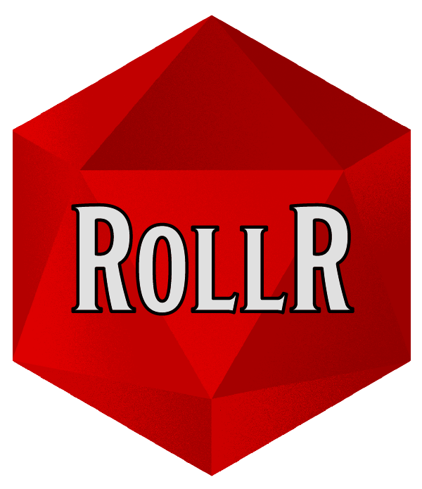

# RollR 

<!-- badges: start -->
<!-- badges: end -->

This R package provides a simple way to make all sorts of dice rolls using syntax inspired from tabletop roleplaying games.


## Installation

```
# install.packages("remotes")
remotes::install_github("felixmil/rollr")
```

## Features Examples


``` r
library(rollr)
set.seed(42)

roll_dice("1d12") # rolls one 12-sided dice
[1] 1

roll_dice("1d12", roll_history = TRUE) # with roll_history, rolls are detailed.

Evaluating "1d12" 
==========
rolls: 5
==========
 Result is 5
[1] 5

roll_dice("1d20+2", roll_history = TRUE) # roll one 20-sided dice then adds 2

Evaluating "1d20+2" 
==========
rolls: 1
==========
 Result is 3
[1] 3

roll_dice("2d10 + 1d4", roll_history = TRUE) # rolls two 10-sided dice and one 4-sided diced and sums their results 

Evaluating "2d10 + 1d4" 
==========
rolls: 9, 10
rolls: 4
==========
 Result is 23
[1] 23

roll_dice("4d6h3", roll_history = TRUE) # rolls four 6-sided dice and sum the 3 highests

Evaluating "4d6h3" 
==========
rolls: 2, 2, 1, 4
keeping 3 highest(s): 4, 2, 2
==========
 Result is 8
[1] 8

roll_dice("2d20l1", roll_history = TRUE) # rolls two 20-sided dice and keeps the lowest one

Evaluating "2d20l1" 
==========
rolls: 5, 14
keeping 1 lowest(s): 5
==========
 Result is 5
[1] 5

roll_dice("6d6!", roll_history = TRUE) # rolls six 6-sided dice. 6 are kept and another dice is rolled and added to the score

Evaluating "6d6!" 
==========
rolls: 4, 2, 2, 3, 1, 1
exploding 0 dice...
==========
 Result is 13
[1] 13

roll_dice("6d4r1", roll_history = TRUE) # rolls 6 4-sided dice. 1 are rerolled until no 1 are found.

Evaluating "6d4r1" 
==========
rolls: 3, 4, 1, 3, 1, 1
rerolling 3 dice
new rolls : 4, 2, 4
==========
 Result is 20
[1] 20

roll_dice("6d6>3", roll_history = TRUE) # rolls six 6-sided dice. count the number of dice above 3. (works with <, <=, >= and =)
Evaluating "6d6>3" 
==========
rolls: 3, 2, 1, 2, 6, 3
number of success: 1 (6)
==========
 Result is 1
[1] 1


```

## Rolls syntax (Feature Checklist)

Features list derivated from [Sidekick](https://github.com/ArtemGr/Sidekick)

- [x] `/r 1d8 + 2` - Roll one octahedron and add two.

- [x] `/r 1d8 + 4d6` - Roll one octahedron and four hexahedrons.

- [x] `/r 2d20h1` - Roll twice and keep the highest roll (D&D 5e advantage).

- [x] `/r 2d20h1 + 2` - Roll twice and keep the highest roll, with a modifier (D&D 5e advantage).

- [x] `/r 2d20l1` - Roll twice and keep the lowest roll (D&D 5e disadvantage).

- [x] `/r 1d20r1` - Roll twenty, reroll on one (because halflings are lucky).

- [x] `/r 3d6!` - Exploding dice.

- [x] `/r 2d6>=5` - Roll two hexahedrons and take only the ones that turned greater or equal to five (aka difficulty check). Prints the number of successes.

- [x] `/r 4d6=5` - So can this guy roll five?

- [ ] `/r 3d10>=6f1` - oWoD roll: rolling *one* is a failure, rolling more failures than successes is a *botch*.

- [ ] `/r 1d10>=8f1f2` - Rolling *one* or *two* is a failure.

- [ ] `/r 4dF` - [Fudge/Fate dice](http://rpg.stackexchange.com/questions/1765/what-game-circumstance-uses-fudge-dice).

- [ ] `/r 1d10!>9` - Explode nine and ten.

- [ ] `/r 3d10!>=8` - nWoD roll: tens explode, eights and up are treated like a success.

- [ ] `/r 1d10t10` - If a ten is rolled then count it twice.

- [x] `/r 4d6k3` - Roll four hexahedrons and keep the highest three (D&D 5e ability roll).

- [ ] `/r repeat (4d6k3, 6)` - Roll D&D 5e ability score six times (to generate a new character).

- [ ] `/r repeat (d6, 3, brief)` - In Nomine. 1, 1, 1.

- [ ] `/r repeat (1d20+1, 5, short sum)` - Sum the rolls.

- [ ] `/r ova (5)` - OVA. 6, 6, 1, 1, 1 = 12.

## Tests

```
Loading rollr
Testing rollr
✓ |  OK F W S | Context
✓ |   1       | evaluate_roll_cmd
✓ |   4       | parse_roll_cmd
✓ |   5       | roll_dice
✓ |  12       | roll_one

══ Results ════════════════════════════════════════
Duration: 0.2 s

OK:       22
Failed:   0
Warnings: 0
Skipped:  0
```

